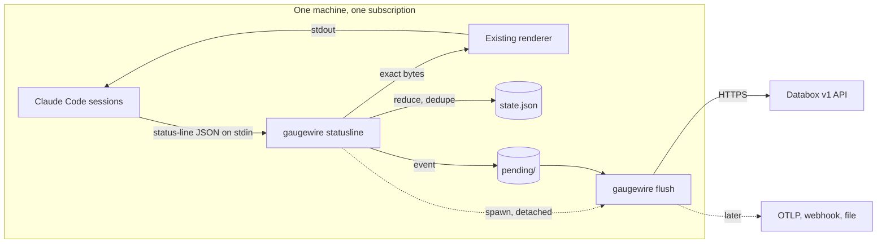

# Gaugewire

Status: Draft · Partial · 2026-09-19 · Lightweight quota observability for a fleet of Claude Code machines: capture, normalize, persist, publish.

## At a glance

Each machine in the fleet runs one Claude subscription and many Claude Code sessions. Claude Code
passes its subscription quota (five-hour and seven-day windows) to whatever status-line command
is configured. Gaugewire installs itself as that command, reads the four quota fields, forwards
the untouched input to the user's own status-line renderer, reduces the observation into one
machine-wide state, and spools an event only when something worth publishing changed. A
short-lived flusher delivers spooled events to the configured sinks. No daemon, no network on
the hot path, no credentials ever read.

> Claude Code owns quota discovery. Gaugewire owns normalization, local durability and delivery.
> Sinks own storage and visualization. **Capture → Normalize → Persist → Publish.**

## Diagram

## Pages

| Page | What it covers |
|---|---|
| [glossary](glossary.md) | Every term used in this spec, with one meaning each |
| [architecture](architecture.md) | Components, package layout, dependency direction, runtime lifecycle, fleet model, extension points |
| [data-contract](data-contract.md) | `QuotaSnapshot v1`, window status, event types, `config.json`, `state.json`, spooled events |
| [reducer-and-dedupe](reducer-and-dedupe.md) | Validation, the per-window state machine, the staleness guard, publish decisions, heartbeat |
| [hot-path](hot-path.md) | What `gaugewire statusline` does in what order, the constraints Claude Code imposes, fail-open rules |
| [spool-and-flush](spool-and-flush.md) | Durable spool, locks, the flusher, retry schedule, dead letters, requeue |
| [databox-sink](databox-sink.md) | Endpoints, datasets, record mapping, batching and ordering, acknowledgement, error classes, bootstrap |
| [cli-and-install](cli-and-install.md) | Every command, the install and uninstall algorithms, `status` and `doctor`, logging, home directory |
| [testing-strategy](testing-strategy.md) | Unit matrix per package, integration tests, fixtures, coverage gates, acceptance test |

## Invariants

Gaugewire must never: call undocumented Anthropic APIs; read Claude credentials, cookies or
session files; read transcripts, prompts, responses or source code; inspect working directories;
switch or rotate accounts; proxy Claude requests; run a permanent daemon; send raw status-line
payloads anywhere; store sink credentials in state, events or logs; infer identity from Claude
auth state; blank or replace the user's status line.

Only normalized quota metadata leaves the machine.

## Out of scope for v1

Automatic account switching or rotation, Claude OAuth access, private Anthropic endpoints,
`/usage` or terminal scraping, multiplexer plugins, MCP ingestion, Grafana integration, Slack
alerts, central remote control, fleet orchestration, per-model quota, credential discovery,
prompt or token analytics, conversation telemetry, the `spend_limit` window, the subagent
status line. None of these are added opportunistically.

## Definition of done

- The documented Claude Code status line is the only quota source.
- Real Pro or Max five-hour and seven-day values are captured and match `/usage`.
- A missing quota never becomes zero.
- The existing status line is preserved byte for byte.
- Concurrent sessions produce one machine state and no duplicate flood.
- No permanent Gaugewire process exists; idle cost is zero.
- A network outage cannot lose a captured event.
- Databox Current holds the latest state per account; History holds idempotent events.
- Credentials never appear in state, events or logs.
- Install is reversible.
- macOS, Linux and Windows work.
- The sink interface is destination-independent and Databox can be replaced without touching
  source or domain code.
- The test suite passes and `doctor` reports healthy on a real installed machine.

## Open questions

- Is usage monotonic within one reset window? Consistent with a measurement across eight
  sessions, where the highest of six readings of one window matched `/usage`; the acceptance
  test confirms it over a full window. How often a window's schedule changes is open:
  [ADR](../../adr/2026-09-20-only-a-recent-payload-may-move-a-window.md).
- Are column types inferred from the first ingestion? Dataset creation does not document a
  schema field; the sink sends typed-looking values either way, and the acceptance test settles
  it.

---
Synthesized from (frozen research): [`2026-09-17-claude-quota-observer-spec-v1.md`](../../research/2026-09-17-claude-quota-observer-spec-v1.md), [`2026-09-17-design-conversation.md`](../../research/2026-09-17-design-conversation.md).
