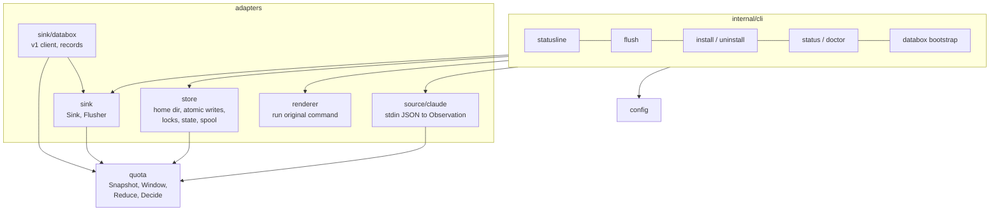
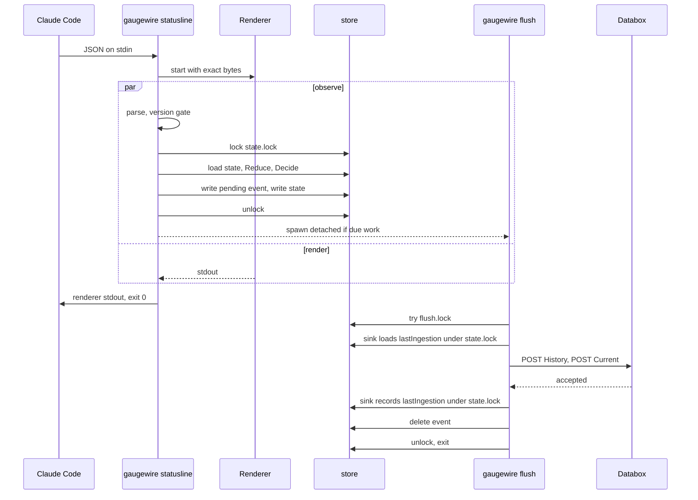

# Architecture

Status: Draft · Built · 2026-09-19 · Components, package layout, dependency direction, runtime lifecycle, fleet model and extension points.

## At a glance

Gaugewire is one static binary with five subcommand groups. The domain (`quota`) knows nothing
about files, processes or networks. Adapters surround it: a source adapter for Claude Code's
status line, a store for state and spool, a renderer bridge, and sinks. The CLI wires them. A
future source or sink touches only its own package. This layout is built.

## Diagram



Dependency direction: `source → quota`; `quota → nothing`; `settings → nothing`;
`store → quota`; `sink → store, quota`; `sink/databox → sink, quota`; `cli → everything`. No package imports `cli`.

## Package layout

```
cmd/gaugewire/main.go        parse subcommand, call run(), exit code
internal/quota/              Snapshot, Window, WindowStatus, Reduce, Decide. Pure, no I/O
internal/source/claude/      status-line JSON → Observation, version gate
internal/store/              home dir, atomic write, flock locks, state.json, pending/, dead-letter/
internal/settings/           edit one member of Claude Code's settings file by byte offsets
internal/renderer/           run the saved command with exact stdin, forward stdout
internal/sink/               Sink interface, Flusher, per-sink delivery bookkeeping
internal/sink/databox/       v1 client, dataset records, error classification, the Sink
internal/config/             config.json load, validate, save
internal/cli/                one file per subcommand; status and doctor rendering
fixtures/statusline/         real and synthetic stdin payloads for tests
```

Platform differences live in build-tagged files: `detach_unix.go` and `detach_windows.go` for
spawning the flusher, `shell_unix.go` and `shell_windows.go` for running the renderer.

## Runtime lifecycle



When Claude is idle, no Gaugewire process exists and no CPU is used. Long-lived multiplexed
sessions therefore cost nothing.

## Fleet model

One Gaugewire installation per OS user corresponds to exactly one Claude subscription.
Identity is configured, never inferred:

```json
"node":    { "id": "generated-uuid", "alias": "mac-mini-01" },
"account": { "id": "configured-uuid", "alias": "claude-01" }
```

If the account logged into a machine changes, the operator re-binds the account identity.
Gaugewire never claims to have verified the account.

## Extension points

- **Sources:** `internal/source/<name>` produces an `Observation`. Anthropic schema changes touch
  only `source/claude`.
- **Sinks:** `internal/sink/<name>` implements `Sink`. The router already supports several
  enabled sinks; each spooled event records which sink ids it targets at capture time, so a
  sink added later never receives history unless explicitly requeued.
- **The stable boundary is `QuotaSnapshot v1`.** Sources and sinks are replaceable around it.

## Open questions

None.
