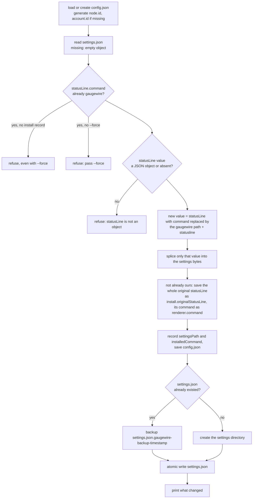

# CLI and install

Status: Draft · Built · 2026-09-18 · Every command, the install and uninstall algorithms, `status` and `doctor`, logging and the home directory.

## At a glance

`gaugewire install` swaps only the `command` of Claude Code's `statusLine` setting for
Gaugewire, keeps everything else in the file byte for byte, saves the original object for an
exact restore, and refuses to overwrite an existing install without `--force`. `uninstall`
restores the original object only if the setting still points at Gaugewire. `status` is
offline; `doctor` runs every offline check plus, once the Databox sink lands, its three sink
checks.

## Commands

| Command | Does |
|---|---|
| `gaugewire statusline` | The [hot path](hot-path.md). Only Claude Code invokes it. |
| `gaugewire flush [--requeue]` | One [flusher run](spool-and-flush.md). `--requeue` first moves dead letters back to pending. |
| `gaugewire install [--settings path] [--node-alias a] [--account-alias b] [--force]` | See below. |
| `gaugewire uninstall [--settings path] [--purge]` | Restore the status line; `--purge` also deletes the home directory. |
| `gaugewire status` | Offline view of state and spool. |
| `gaugewire doctor [--settings path]` | Full health check, exit 1 on any failing check. |
| `gaugewire databox bootstrap [--account-id n] [--api-key-file path] [--test-ingest]` | See [databox-sink](databox-sink.md). |
| `gaugewire version` | Version, commit, date from build info. |

Built: every command except `databox bootstrap`. `doctor`'s sink auth, datasets and last
ingestion rows arrive with the Databox sink.

`flush -h` prints usage and exits 0. A retryable delivery failure makes `flush` exit 1, which is
harmless for the detached run: a later status-line invocation relaunches it when work is still
due.

## Install



Rules: aliases default to the hostname and `claude-01`; `padding`, `refreshInterval`,
`hideVimModeIndicator` and unknown keys are kept; `type: "command"` is added whenever the object
has no `type`, and an absent `statusLine` or an object with no members becomes a fresh
`{"type":"command","command":…}`; the binary path comes from `os.Executable()` and uses forward
slashes on Windows, per the [status line page](https://code.claude.com/docs/en/statusline); the
splice locates the top-level member by decoder token offsets so no other byte of the file
changes. `refreshInterval` is never removed by install; `doctor` may advise.

`config.json` is saved before the settings file is touched, so every intermediate state — a
crash between the two writes — still knows how to get back to the user's original status line.
A status line already pointing at Gaugewire is refused unless `--force`; it is refused outright,
`--force` or not, when `config.json` has no install record to restore from, and the message
points at the newest `.gaugewire-backup-*` file to restore by hand. `--force` keeps the saved
original and only refreshes the installed command. The backup is
`settings.json.gaugewire-backup-<UTC timestamp>` with mode 0600, suffixed `-2`, `-3` and so on
when a second install lands in the same second. `--settings` is resolved and stored as an
absolute path. A `statusLine` whose value is not a JSON object is refused before anything is
written, settings file or `config.json`. `install.originalStatusLine` is omitted from
`config.json` entirely when there was no `statusLine` to save, rather than stored as `null`.
The settings path is resolved through symlinks before it is used, so a dotfiles-managed file is
edited in place and the backup sits next to the real file; writing through a temporary file and
rename then replaces the real file rather than the link.
The executable path is quoted only when it contains whitespace; assumption to verify on
Windows: PowerShell requires `& "path" statusline` for a quoted path, which the installed
command does not emit yet.

## Uninstall

If `statusLine.command` still equals `install.installedCommand`, restore
`install.originalStatusLine` by the same splice (or delete the member when there was none) and
clear `install` in config. Otherwise print a warning and change nothing. Local data stays
unless `--purge`.

The restored value is `install.originalStatusLine` compacted onto one line and written
JSON-equal to the original, since `config.json` cannot keep the original's exact source bytes;
every other byte of the settings file is left untouched. (The timestamped backup written at
install time, by contrast, is a byte-exact copy an operator can restore by hand.) `--purge`
deletes the home directory even when the status line was changed since install; the warning
about the change is still printed first. When the settings file already equals the original,
uninstall prints `already restored` and clears the install record without writing the settings
file again — this is also how a run that died between writing the settings file and saving
`config.json` finishes cleanly on the next attempt. A missing settings file prints
`warning: <path> does not exist; nothing restored` and leaves the install record untouched, since
nothing was restored. `--settings` overrides the recorded path. An invalid `config.json` is
refused before anything is touched.

## status

```
Gaugewire

Node:     mac-mini-01
Account:  claude-01

5h:       24%        Reset:  18:20
7d:       53%        Reset:  Sep 18 09:00

Last observation:  2m ago
Last publish:      2m ago

Pending events:    0
Dead letters:      0

databox-main:      last flush ok 2m ago
```

One line per enabled sink, keyed by its id. When `state.json` cannot be decoded, the first output
line is `state.json is not valid; showing a fresh state` and the view shows a fresh state. The
`Dead letters` line above shows `0` because the example has none; whenever there is at least one,
it grows a ` · newest: <reason>` suffix naming the newest dead letter's reason. When
`dead-letter/` itself cannot be read, the first output line is
`dead-letter/ could not be read; newest reason unavailable` and the rest of the view still
renders.

Reads `state.json` and counts spool files. No network.

## doctor

| Check | How |
|---|---|
| Configuration | `config.json` parses and validates |
| Claude Code version | from the last observation, at least 2.1.251 |
| Status-line integration | `settings.json` `statusLine.command` points at this binary |
| Overrides | project `.claude/settings.local.json` or `.claude/settings.json` in the current directory overriding `statusLine`; `disableAllHooks: true` in any of those files or the settings file, in that precedence order |
| Renderer | the saved command runs against a documented sample status-line payload under a five-second timeout; a failure reports `<command>: <error>` |
| Identity | node and account ids are UUIDs, aliases set |
| Home directory | exists, permissions, state readable, spool writable |
| Quota windows | status of each window and age of the last observation |
| `refreshInterval` | advice only when set |
| Sink auth (with the Databox sink) | `GET /v1/auth/validate-key` |
| Datasets (with the Databox sink) | both ids present in `GET /v1/data-sources/{id}/datasets` |
| Last ingestion (with the Databox sink) | latest ingestion id per dataset polled; `failed` shown with its errors |
| Spool | pending and dead-letter counts, the newest dead-letter reason, and the count of `.unreadable` files |

The overrides check reads `.claude/settings.local.json` before `.claude/settings.json` in the
current directory, then the settings file, matching Claude Code's documented precedence
([settings](https://code.claude.com/docs/en/settings)); it treats `disableAllHooks: true` as a
failure because the settings reference states it disables the status line outside managed
settings ([settings reference](https://code.claude.com/docs/en/settings-reference)).

Output is one line per check, `✓ name: detail` or `✗ name: detail`, a blank line, then `HEALTHY`
or `UNHEALTHY`; exit code 1 on any ✗.

## Logging

`log/slog` JSON lines to `logs/gaugewire.log`, rotated to `.1` at 1 MiB. Fields are limited to
timestamps, event ids, parse success or failure with the failing field path, sink id, delivery
status, attempt count, error code and observer version. Never logged: raw status-line JSON,
session ids, paths, repositories, transcripts, prompts, credentials. Error reasons may name files
inside the Gaugewire home directory; nothing outside it is ever logged.

## Home directory

| OS | Default |
|---|---|
| macOS | `~/Library/Application Support/gaugewire` |
| Linux | `$XDG_CONFIG_HOME/gaugewire` or `~/.config/gaugewire` |
| Windows | `%AppData%\gaugewire` |

`GAUGEWIRE_HOME` overrides. Decision:
[ADR](../../adr/2026-09-17-json-config-in-one-home-directory.md).

## Open questions

None.
