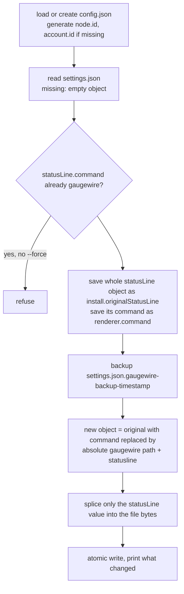

# CLI and install

Status: Draft · Planned · 2026-09-17 · Every command, the install and uninstall algorithms, `status` and `doctor`, logging and the home directory.

## At a glance

`gaugewire install` swaps only the `command` of Claude Code's `statusLine` setting for
Gaugewire, keeps everything else in the file byte for byte, saves the original object for an
exact restore, and refuses to overwrite an existing install without `--force`. `uninstall`
restores the original object only if the setting still points at Gaugewire. `status` is
offline; `doctor` checks everything including the sink.

## Commands

| Command | Does |
|---|---|
| `gaugewire statusline` | The [hot path](hot-path.md). Only Claude Code invokes it. |
| `gaugewire flush [--requeue]` | One [flusher run](spool-and-flush.md). `--requeue` first moves dead letters back to pending. |
| `gaugewire install [--settings path] [--node-alias a] [--account-alias b] [--force]` | See below. |
| `gaugewire uninstall [--purge]` | Restore the status line; `--purge` also deletes the home directory. |
| `gaugewire status` | Offline view of state and spool. |
| `gaugewire doctor` | Full health check, exit 1 on any failing check. |
| `gaugewire databox bootstrap [--account-id n] [--api-key-file path] [--test-ingest]` | See [databox-sink](databox-sink.md). |
| `gaugewire version` | Version, commit, date from build info. |

## Install



Rules: aliases default to the hostname and `claude-01`; `padding`, `refreshInterval`,
`hideVimModeIndicator` and unknown keys are kept; `type: "command"` is added only when no object
existed; the binary path comes from `os.Executable()` and uses forward slashes on Windows; the
splice locates the top-level member by decoder token offsets so no other byte of the file
changes. `refreshInterval` is never removed by install; `doctor` may advise.

## Uninstall

If `statusLine.command` still equals `install.installedCommand`, restore
`install.originalStatusLine` by the same splice (or delete the member when there was none) and
clear `install` in config. Otherwise print a warning and change nothing. Local data stays
unless `--purge`.

## status

```
Gaugewire

Node:     mac-mini-01
Account:  claude-01

5h:       24%        Reset:  18:20
7d:       53%        Reset:  Sep 18 09:00

Last observation:  2m ago
Last publish:      2m ago

Pending events:    0
Dead letters:      0

Databox:           last flush ok 2m ago
```

Reads `state.json` and counts spool files. No network.

## doctor

| Check | How |
|---|---|
| Configuration | `config.json` parses and validates |
| Claude Code version | from the last observation, at least 2.1.251 |
| Status-line integration | `settings.json` `statusLine.command` points at this binary |
| Overrides | project `.claude/settings.json` or `settings.local.json` in the current directory overriding `statusLine`; `disableAllHooks` in any settings file |
| Renderer | saved command exists and runs with a sample payload |
| Identity | node and account ids are UUIDs, aliases set |
| Home directory | exists, permissions, state readable, spool writable |
| Quota windows | status of each window and age of the last observation |
| `refreshInterval` | advice only when set |
| Sink auth | `GET /v1/auth/validate-key` |
| Datasets | both ids present in `GET /v1/data-sources/{id}/datasets` |
| Last ingestion | latest ingestion id per dataset polled; `failed` shown with its errors |
| Spool | pending and dead-letter counts with the newest reason |

Output is one line per check with ✓ or ✗ and a final `HEALTHY` or `UNHEALTHY`; exit code 1 on
any ✗.

## Logging

`log/slog` JSON lines to `logs/gaugewire.log`, rotated to `.1` at 1 MiB. Fields are limited to
timestamps, event ids, parse success or failure with the failing field path, sink id, delivery
status, attempt count, error code and observer version. Never logged: raw status-line JSON,
session ids, paths, repositories, transcripts, prompts, credentials.

## Home directory

| OS | Default |
|---|---|
| macOS | `~/Library/Application Support/gaugewire` |
| Linux | `$XDG_CONFIG_HOME/gaugewire` or `~/.config/gaugewire` |
| Windows | `%AppData%\gaugewire` |

`GAUGEWIRE_HOME` overrides. Decision:
[ADR](../../adr/2026-09-17-json-config-in-one-home-directory.md).

## Open questions

None.
