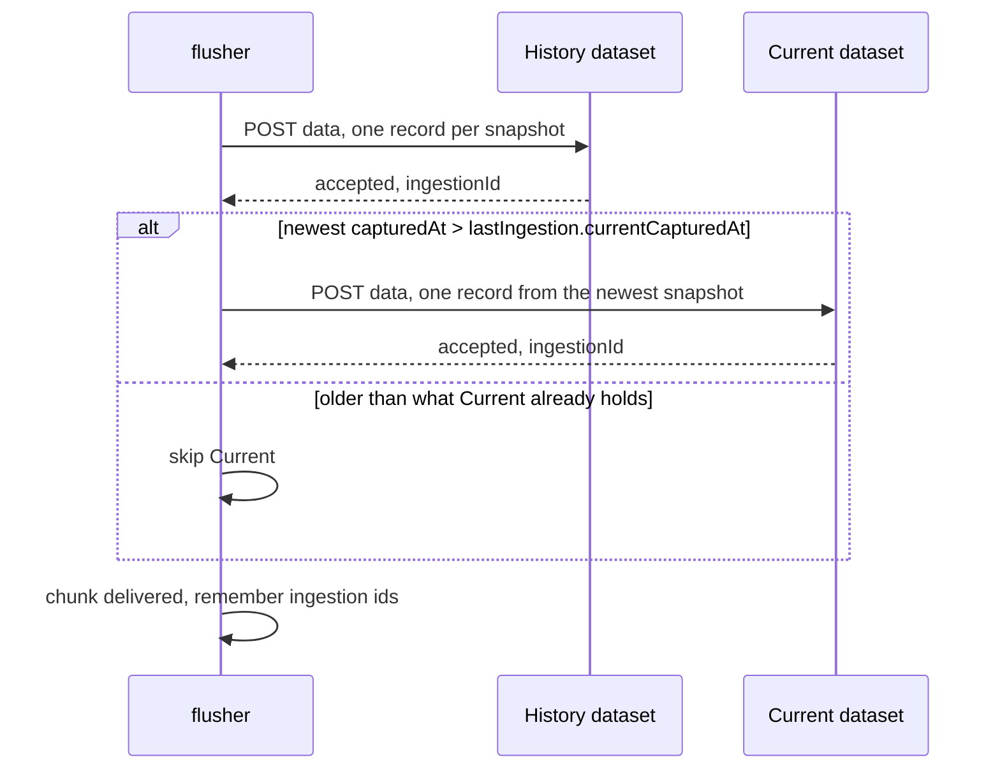
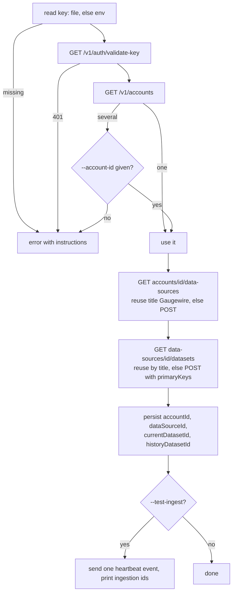

# Databox sink

Status: Draft · Planned · 2026-09-17 · The first sink: Databox REST API v1, two datasets, batching and ordering, acknowledgement, error classes and bootstrap.

## At a glance

The sink writes every event to a History dataset keyed by `event_id` and the newest event of a
batch to a Current dataset keyed by `account_id`. Both keys upsert, so any resend is safe. The
API accepts ingestion asynchronously; an accepted request is the acknowledgement, and `doctor`
polls the latest ingestion to surface a failure. Everything the sink knows about the API comes
from the public developer documentation; two behaviours it does not document are recorded as
assumptions.

## API facts (public documentation)

- Base `https://api.databox.com`, header `x-api-key`, JSON, every response carries `requestId`.
- `GET /v1/auth/validate-key`; `GET /v1/accounts`; `GET /v1/accounts/{accountId}/data-sources`;
  `POST /v1/data-sources`; `GET /v1/data-sources/{id}/datasets`; `POST /v1/datasets`;
  `POST /v1/datasets/{id}/data`; `GET /v1/datasets/{id}/ingestions/{ingestionId}`.
- Data sources have integer ids and take `title`, optional `accountId` and `timezone`. Datasets
  have string ids and take `title`, `dataSourceId`, `primaryKeys []string`, declared at creation.
- Ingestion body `{"records":[{...}]}`, at most 100 records per request. The response carries an
  `ingestionId`; the ingestion status endpoint reports metrics that separate new, overwritten
  and rejected records. Overwritten means a record with an existing primary key replaced the
  stored row.
- Error envelope `{"status":"error","errors":[{code,message,field?,type}],"requestId"}`.
  Documented codes include `invalid_api_key`, `forbidden`, `invalid_field_value`,
  `schema_mismatch`, `missing_required_field`, `not_found`, `rate_limited`,
  `request_too_large`, `processing_failed`, `internal_error`, `service_unavailable`. Status codes
  per error are not documented.
- Limits: 10 000 requests per hour and 10 per second per key; backoff is expected.

## Assumptions to verify

- Whether dataset creation accepts a column `schema` with `string|number|datetime` types, or
  types are inferred from the first ingestion. The sink sends every column in every record,
  `null` when unknown, and RFC 3339 timestamps, so it works either way.
- Whether a throttling 429 carries the JSON envelope. The classifier does not depend on it.

## Datasets

One data source titled `Gaugewire`, timezone `UTC`, with two datasets.

**Claude Quota History**, primary key `event_id`, one row per event:
`event_id, event_type, account_id, account_alias, node_id, node_alias, platform, captured_at,
published_at, five_hour_status, five_hour_used_percentage, five_hour_resets_at,
seven_day_status, seven_day_used_percentage, seven_day_resets_at, source_type,
claude_code_version, observer_version`.

**Claude Quota Current**, primary key `account_id`, one row per subscription:
`account_id, account_alias, node_id, node_alias, platform, latest_event_id, captured_at,
last_seen_at, five_hour_status, five_hour_used_percentage, five_hour_resets_at,
seven_day_status, seven_day_used_percentage, seven_day_resets_at, claude_code_version,
observer_version`.

Every column is present in every record, `null` when unknown. Timestamps are RFC 3339 UTC with
millisecond precision; percentages are JSON numbers. `published_at` and `last_seen_at` are set
by the flusher at send time. If a schema is accepted, `*_at` columns are `datetime`,
`*_used_percentage` are `number`, everything else `string`.

## Delivery of one chunk

History first, then Current. Both accepted is success. Otherwise the whole chunk is retried or
dead-lettered; the primary keys make resending safe. Chunks are chronological, Current gets the
newest snapshot of the chunk, and the `currentCapturedAt` guard keeps a requeued old event from
overwriting newer state.

## Acknowledgement

An HTTP 200 with an `ingestionId` is the ack; the event is deleted. Asynchronous processing
failures are surfaced by `doctor`, which polls the latest ingestion id per dataset. The stricter
verify-before-ack mode is in the nice-to-have ledger. Decision:
[ADR](../../adr/2026-09-17-databox-sink-targets-v1-and-acks-on-accept.md).

## Credentials

`apiKeyFile` (`0600`, recommended for fleet machines whose Claude sessions start without a
shell profile) or the environment variable named by `apiKeyEnv`. The key is never logged,
never stored in config, state or events.

## Bootstrap

Existing ids in config are verified and only missing resources are created; repeated runs
create nothing new.

## Open questions

- The two assumptions above.
