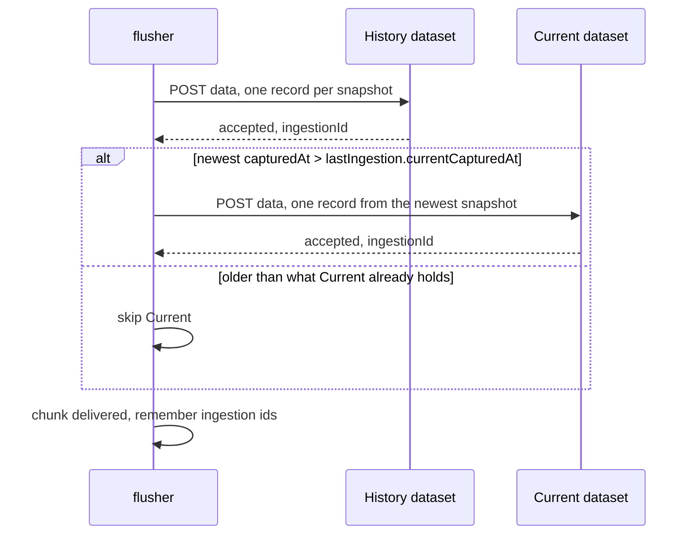
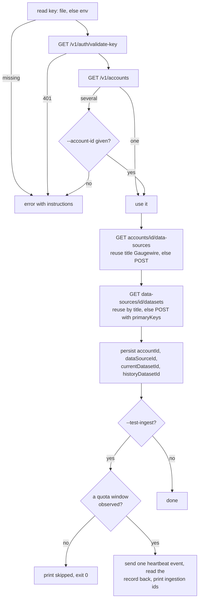

# Databox sink

Status: Draft · Partial · 2026-09-19 · The first sink: Databox REST API v1, two datasets, batching and ordering, acknowledgement, error classes and bootstrap.

## At a glance

The sink writes every event to a History dataset keyed by `event_id` and the newest event of a
batch to a Current dataset keyed by `account_id`. Both keys upsert, so any resend is safe. The
API accepts ingestion asynchronously; an accepted request is the acknowledgement, and `doctor`
polls the latest ingestion to surface a failure. Everything the sink knows about the API comes
from the public developer documentation; the behaviours it does not document are recorded as
assumptions. The code is built; the acceptance test on a real machine, which settles those
assumptions, is outstanding.

## API facts (public documentation)

- Base `https://api.databox.com`, header `x-api-key`, JSON request and response bodies, every
  response carries `requestId`.
- `GET /v1/auth/validate-key`: 200 when the key is valid, 401 when it is missing or invalid.
- `GET /v1/accounts` → `{requestId, status, accounts:[{id int, name, accountType}]}`.
- `GET /v1/accounts/{accountId}/data-sources` →
  `{dataSources:[{id int, title, created, timezone, key, ingestionSupported}]}`.
- `POST /v1/data-sources` body `{title (required), accountId int, timezone}` →
  `{id int, title, created, timezone, key, ingestionSupported}`.
- `GET /v1/data-sources/{id}/datasets` → `{datasets:[{id string, title, created}]}`.
- `POST /v1/datasets` body `{title, dataSourceId int (required), primaryKeys []string|null}` →
  `{id string, title, created}`. Column types are not part of the documented request.
- `POST /v1/datasets/{id}/data` body `{records:[{...}]}`, at most 100 records per ingestion
  event → `{requestId, status, ingestionId, message}`.
- `GET /v1/datasets/{id}/ingestions/{ingestionId}` →
  `{requestId, status, ingestionId, timestamp, metrics{datasetMetrics{columnsCount,
  datasetSizeMB, totalDatasetRecordsCount}, ingestionMetrics{appendedRecordsCount,
  receivedRecordsCount, rejectedRecordsCount, overwrittenRecordsCount}}}`. Overwritten means a
  record with an existing primary key replaced the stored row.
- Error envelope `{requestId, status:"error", errors:[{code (string|null), message, field,
  type}]}` on 400 and 401.
- Rate limits: 10 000 requests per hour and 10 per second per key; backoff is expected. Payloads
  are at most 500 rows or 10 MB per request, on top of the 100-record ingestion limit.

## Assumptions to verify

- Whether column types are inferred from the first ingestion, so that `*_at` columns behave as
  datetimes on dashboards rather than strings. The sink sends every column in every record,
  `null` when unknown, and RFC 3339 timestamps, so it works either way.
- Whether a throttling 429 carries the JSON envelope. The classifier does not depend on it.
- What status codes errors other than the documented 400 and 401 arrive with.
- Whether an error always arrives with a non-2xx status; a 200 carrying `"status":"error"` would
  be read as success by key validation today, and retried by an ingestion, which needs its
  `ingestionId`.
- Whether the list endpoints return every item without pagination. The ingestions list documents
  `page` and `pageSize`; the accounts, data-sources and datasets lists document neither.

## Datasets

One data source titled `Gaugewire`, timezone `UTC`, with two datasets.

**Claude Quota History**, primary key `event_id`, one row per event:
`event_id, event_type, account_id, account_alias, node_id, node_alias, platform, captured_at,
published_at, five_hour_status, five_hour_used_percentage, five_hour_resets_at,
seven_day_status, seven_day_used_percentage, seven_day_resets_at, source_type,
claude_code_version, observer_version`.

**Claude Quota Current**, primary key `account_id`, one row per subscription:
`account_id, account_alias, node_id, node_alias, platform, latest_event_id, captured_at,
last_seen_at, five_hour_status, five_hour_used_percentage, five_hour_resets_at,
seven_day_status, seven_day_used_percentage, seven_day_resets_at, claude_code_version,
observer_version`.

Every column is present in every record, `null` when unknown. Timestamps are RFC 3339 UTC with
millisecond precision; percentages are JSON numbers. `published_at` and `last_seen_at` are set
by the flusher at send time. Column types are not declared at creation; if they are instead
inferred from the first ingestion, the values are already shaped so `*_at` columns land as
`datetime`, `*_used_percentage` as `number`, and everything else as `string`.

## Delivery of one chunk

The flusher hands the sink one `Delivery` per event — its event type and the snapshot, nothing
else. History first, then Current. Both accepted is success. Otherwise the whole chunk is
retried or dead-lettered; the primary keys make resending safe. Chunks are chronological,
Current gets the newest snapshot of the chunk, and the `currentCapturedAt` guard keeps a
requeued old event from overwriting newer state: Current is skipped whenever the newest
snapshot's `capturedAt` is not strictly after what is already recorded, so an equal capture time
is skipped too. `published_at` (History) and `last_seen_at` (Current) are the send time, not the
snapshot's `capturedAt`.

Once History has accepted the chunk — and Current too, when the guard sent it a request — the
sink saves its ingestion record — the two ingestion ids and the `capturedAt` Current now holds —
in `state.json` under `state.lock`. A failure to save is logged and never retried, because the
API already accepted the data; the chunk is not failed for it. A lost save (the `state.lock`
wait timed out) leaves the previous record in place, so the `currentCapturedAt` guard is
bypassed on every following chunk until a newer event's save succeeds and corrects Current.

## Acknowledgement

An HTTP 200 with an `ingestionId` is the ack; the event is deleted. Asynchronous processing
failures are surfaced by `doctor`, which polls the latest ingestion id per dataset. The
ingestion status endpoint's documented shape carries metrics but no error list, and its
`status` field is only the response envelope's — `success` whenever the API accepted the
request, whether or not any record was rejected — so `doctor` judges an ingestion by its
`rejectedRecordsCount`, never by `status`. The stricter verify-before-ack mode is in the
nice-to-have ledger. Decision:
[ADR](../../adr/2026-09-17-databox-sink-targets-v1-and-acks-on-accept.md).

## Credentials

`apiKeyFile` (`0600`, recommended for fleet machines whose Claude sessions start without a
shell profile) or the environment variable named by `apiKeyEnv`. A key file readable by others
is still used, with a warning, rather than refused; `doctor`'s sink auth row shows the warning
next to `key valid`. A key file that does not exist is reported without its path, since a key
pasted where the path belongs would otherwise be printed back. The key is never logged, never
stored in config, state or events. Redirects are refused, so the `x-api-key` header is never replayed to
another host.

## Bootstrap

`gaugewire databox bootstrap [--account-id n] [--api-key-file path] [--base-url url]
[--sink-id id] [--test-ingest]` prints one line per resource as it resolves: `account:`,
`data source:`, `history dataset:` and `current dataset:` (each `created` or `reused`), and,
with `--test-ingest`, `test ingest:` with both ingestion ids, or why it was skipped.

Every run re-resolves the data source and the two datasets by title against the account's
current lists — an id already in config.json is never trusted, only overwritten — so a title
match is reused and only a missing one is created; repeated runs create nothing new.
`--base-url` defaults to the public host and overwrites a configured `baseUrl` on every run; the
flag exists so a test can point bootstrap at `httptest`, not to repoint a fleet machine at a
different real host. A data source is reused by title whether or not it reports
`ingestionSupported`; with two data sources sharing a title, the first one the API lists wins.
When several accounts are reachable and `--account-id` is not given, the error lists them by id
and name (`several accounts are reachable; pass --account-id: 123456 Acme, 7 Other`) and nothing
is saved.

`--test-ingest` sends one heartbeat snapshot after bootstrapping, but only once `state.json`
holds an observed quota window: before Claude Code has shown its status line the heartbeat would
carry nothing but nulls, so the command prints `test ingest:      skipped: no quota observation
yet; run it again after Claude Code has shown its status line` and succeeds without a request.
It fails if the ingestion record read back from `state.json` after the API accepted the
heartbeat is missing or does not carry this send's time, since an unrecorded ingestion, or a
record an earlier run left behind, would otherwise look like a working sink. So run bootstrap
at setup, and `gaugewire databox bootstrap --test-ingest` again after the first observation;
bootstrap is idempotent, so the second run creates nothing. A key-file permission warning
from bootstrap goes to stderr, not only to the log.

## Open questions

- The assumptions above.
