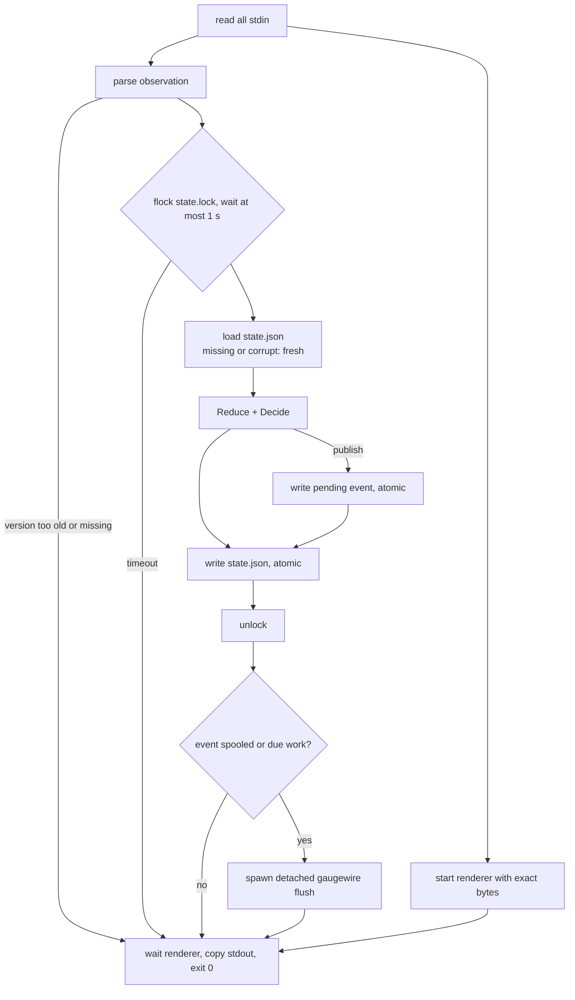

# Hot path

Status: Draft · Planned · 2026-09-17 · What `gaugewire statusline` does between stdin and exit, and the rules Claude Code imposes on it.

## At a glance

The hot path has two jobs that must not interfere: keep the user's status line exactly as it
was, and record the observation durably. The renderer starts first and its output is forwarded
verbatim. Observation runs in parallel, fails open at every step, and does no network work. If
delivery is due, a detached flusher is spawned and the hot path exits without waiting for it.

## Diagram

## Constraints from Claude Code

- The script runs on session start and resume, each assistant message, `/compact`, permission
  or vim mode changes, `command` changes, `refreshInterval` ticks, and when a known `resets_at`
  or cache `expires_at` arrives. Updates debounce at 300 ms.
- **A new trigger cancels the in-flight script.** Everything durable must be atomic; nothing may
  depend on finishing.
- **Stdout is a pipe Claude Code reads.** Any child that inherits it keeps the status line
  waiting until the child exits.
- On Windows the command runs through Git Bash when installed, else PowerShell.

## Rules

1. Gaugewire writes zero bytes of its own to stdout, ever. Renderer stderr passes through.
2. No network on this path.
3. The renderer runs through `/bin/sh -c` on Unix and, on Windows, through `bash -c` when
   `bash` is on `PATH`, else `powershell -NoProfile -Command`. It runs in Gaugewire's process
   group so Claude Code's cancellation reaches it.
4. The flusher is spawned with stdin from the null device and stdout and stderr redirected to
   the log file, in its own session (`Setsid` on Unix, `CREATE_NEW_PROCESS_GROUP |
   DETACHED_PROCESS` on Windows). If spawning fails the spool stays intact and a later
   invocation retries.
5. A flusher is spawned when an event was just spooled, or when any pending event is due.
6. Lock wait is bounded at one second; on timeout the observation is dropped and logged.
7. No log line on the no-op path. Logs only on publish, skip or error.
8. Budget: p95 under 50 ms of Gaugewire's own work, excluding the renderer.

## No renderer configured

If no status line existed before install, Gaugewire renders nothing. Claude Code hides its
footer keyboard hints once any status line is configured; `install` says so.

## Open questions

None.
