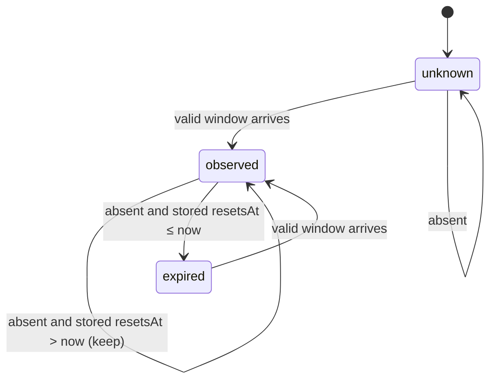

# Reducer and dedupe

Status: Draft · Planned · 2026-09-17 · How one observation becomes machine state, and when state becomes an event.

## At a glance

Each window is reduced independently through a three-state machine. A missing window is never
zero. Because many sessions each re-send their own last-known values, a staleness guard keeps an
idle session from flapping the state. Publishing is decided against the last published snapshot,
not the previous input, so small drifts accumulate until they cross the threshold.

## Diagram

## Validation

An incoming window is valid when `0 ≤ used_percentage ≤ 100` and `resets_at` is a positive
integer of epoch seconds. An invalid window is treated as absent for that invocation and the
failing field path is logged once. The `version` must parse and be at least `2.1.251`;
otherwise the whole observation is skipped and rendering continues.

## Reducer rules, per window

| Incoming | Stored | Result |
|---|---|---|
| present, valid | not `observed` | accept: `observed`, copy value and reset |
| present, valid | `observed`, incoming `resetsAt` newer | accept (new window) |
| present, valid | `observed`, same `resetsAt`, incoming `used ≥ stored` | accept |
| present, valid | `observed`, same `resetsAt`, incoming `used < stored` | ignore (stale session) |
| present, valid | `observed`, incoming `resetsAt` older | ignore (stale session) |
| absent | `unknown` | stay `unknown` |
| absent | stored `resetsAt > now` | keep stored (a new session before its first response) |
| absent | stored `resetsAt ≤ now` | `expired`, `usedPercentage = null`, keep `resetsAt` |

**Why the guard exists.** Every session re-sends its last-known `rate_limits` on every trigger,
including timer ticks. An idle session at 40 % and an active session at 70 % with the same reset
would otherwise alternate the machine state and publish on every flip. The guard assumes usage
is monotonic within one reset window. If a percentage is ever lowered mid-window, the guard holds
the higher value until the window resets, which is acceptable. The
[acceptance test](../../how-tos/acceptance-test.md) confirms the assumption.

Expiry is derived from the stored reset time, because Claude Code stops sending a window once
its reset passes.

## Publish decision

`Decide` compares the reduced state with `state.lastPublished`. First matching row wins.

| Condition (any window) | Publish | `eventType` |
|---|---|---|
| no `lastPublished` and at least one window `observed` | yes | `state_transition` |
| a window `status` differs | yes | `state_transition` |
| a `resetsAt` differs | yes | `change` |
| abs(`used` − last published `used`) ≥ `minDeltaPercentage` | yes | `change` |
| `now − lastPublished.capturedAt ≥ heartbeatInterval` and any window `observed` | yes | `heartbeat` |
| otherwise | no | |

Both windows `unknown` never publishes, so a fresh machine emits no meaningless first event.
Published values are the actual values, never rounded. `lastPublished` is updated when the
event is spooled, not when delivered: publishing is decided locally, delivery is the spool's job.

Defaults: `minDeltaPercentage: 1.0`, `heartbeatInterval: 30m`. Example against a last published
40.0: 40.2, 40.4, 40.7 are ignored; 41.1 publishes 41.1.

## Open questions

- Monotonic usage within a window: assumption, see above.
