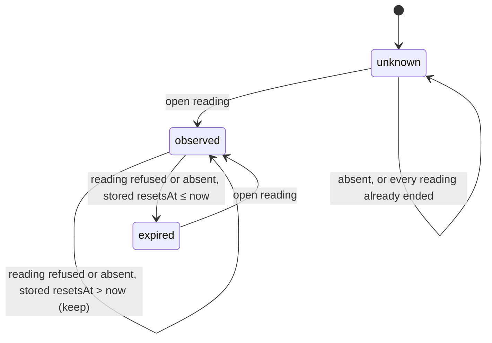

# Reducer and dedupe

Status: Draft · Built · 2026-09-20 · How one observation becomes machine state, and when state becomes an event.

## At a glance

Each window is reduced independently through a three-state machine. A missing window is never
zero. Every open Claude Code session runs the status line with the rate limits it last received,
so one machine sees many readings of one window, and after a schedule change readings of a
window that no longer applies. A window is identified by its reset time; a reading of a window that
has ended says nothing, only a payload from the last five hours may name a different window,
and within one window usage only rises. Publishing
is decided against the last published snapshot, not the previous input, so small drifts
accumulate until they cross the threshold.

## Diagram

## Validation

An incoming window is valid when `0 ≤ used_percentage ≤ 100` and `resets_at` is a positive
integer of epoch seconds. An invalid window is treated as absent for that invocation; the parser
reports the failing window path (`rate_limits.five_hour` or `rate_limits.seven_day`) to its
caller, and the hot path (not yet built) logs it once. The
`version` must parse and be at least `2.1.251`; otherwise the whole observation is skipped and
rendering continues.

## Reducer rules, per window

| Incoming | Stored | Result |
|---|---|---|
| present, `resetsAt ≤ now` | any | ignore: that window has ended |
| present, open | not `observed` | accept: `observed`, copy value and reset |
| present, open | `observed`, stored `resetsAt ≤ now` | accept: the stored window has ended |
| present, open | `observed`, same `resetsAt`, incoming `used ≥ stored` | accept |
| present, open | `observed`, same `resetsAt`, incoming `used < stored` | ignore (a session behind the others) |
| present, open | `observed`, different `resetsAt`, payload of the last five hours | accept: the current window |
| present, open | `observed`, different `resetsAt`, older payload | ignore: a superseded schedule |
| absent, or ignored | `unknown` | stay `unknown` |
| absent, or ignored | stored `resetsAt > now` | keep stored |
| absent, or ignored | stored `resetsAt ≤ now` | `expired`, `usedPercentage = null`, keep `resetsAt` |

**Why the guard exists.** Measured on a machine with eight open sessions, each ticking every
five seconds: seven-day readings of 27, 44, 64, 66, 76 and 78 per cent all carried the same
reset, one per session's cache, and the highest matched what Claude Code's `/usage` reported.
Two further sessions carried a different reset, four days later, at 7 and 1 per cent: the
schedule of the weekly window had changed and those sessions predated it. Taking the reading
with the furthest reset locked the machine onto the superseded window, and every correct reading
was then refused until that reset passed. Reset order alone cannot settle it: taking the
soonest open reset is right until the current window ends, and then the superseded window,
which still has days left, becomes the soonest and captures the machine again.

What settles it is the five-hour window. It is five hours long, so a payload whose five-hour
window has not reset yet was taken within the last five hours. Windows partition time, so
under one schedule every payload with time left names the same reset: two open resets mean
two schedules, and the recent payload is the one that knows which holds. In the measurement
only the session in use carried a five-hour window at all. Within one window usage only rises,
so the highest value is the truth whatever the payload's age, and a session behind the others
never flaps the state. Decision:
[ADR](../../adr/2026-09-20-only-a-recent-payload-may-move-a-window.md).

`lastObservedAt` records that a payload arrived, including one whose readings were all
refused, so a fresh observation time can sit above a window that is `expired`.

Expiry is derived from the stored reset time. Claude Code appeared to drop a window once its
reset passed, but the reducer no longer depends on that: a reading whose reset has passed is
refused whoever sends it.

## Publish decision

`Decide` compares the reduced state with `state.lastPublished`. First matching row wins.

| Condition (any window) | Publish | `eventType` |
|---|---|---|
| no `lastPublished` and at least one window `observed` | yes | `state_transition` |
| a window `status` differs | yes | `state_transition` |
| a `resetsAt` differs | yes | `change` |
| abs(`used` − last published `used`) ≥ `minDeltaPercentage` | yes | `change` |
| `now − lastPublished.capturedAt ≥ heartbeatInterval` and any window `observed` | yes | `heartbeat` |
| otherwise | no | |

Both windows `unknown` never publishes, so a fresh machine emits no meaningless first event.
Published values are the actual values, never rounded. `lastPublished` is updated when the
event is spooled, not when delivered: publishing is decided locally, delivery is the spool's job.

Defaults: `minDeltaPercentage: 1.0`, `heartbeatInterval: 30m`. Example against a last published
40.0: 40.2, 40.4, 40.7 are ignored; 41.1 publishes 41.1.

## Open questions

- Monotonic usage within a window: consistent with the measurement above, where the highest of
  six readings of one window matched `/usage`. The acceptance test confirms it over a full window.
- How often the subscription's window schedule changes. A change is followed as soon as one
  session in use reports it; while every session on the machine has been idle for more than
  five hours, the machine keeps the window it holds until that window ends.
