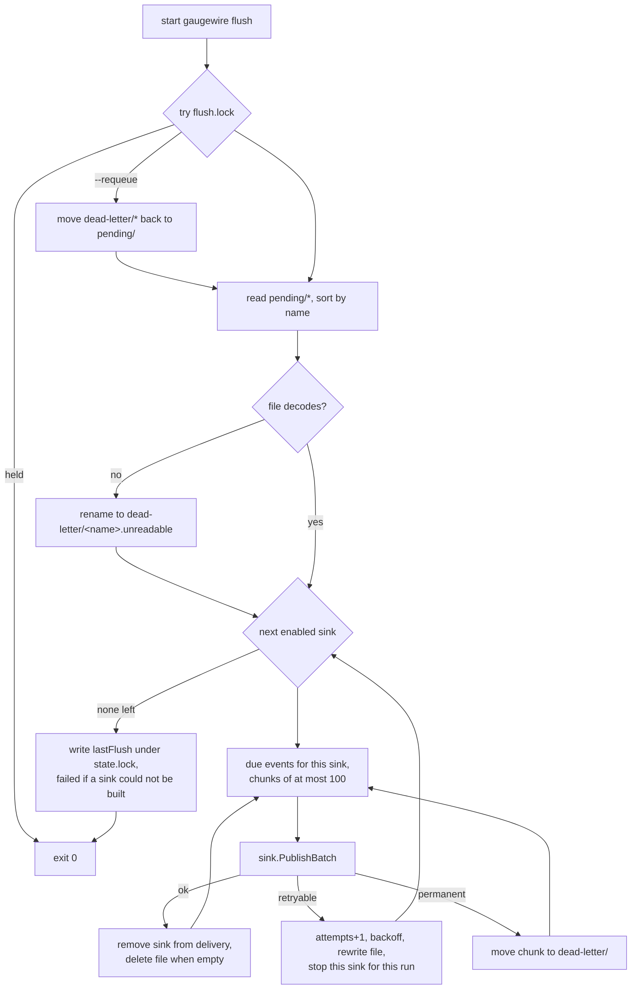

# Spool and flush

Status: Draft · Built · 2026-09-19 · Local durability first, network second: the spool, the locks, the flusher, retries and dead letters.

## At a glance

An event is safe on disk before any delivery is attempted. The flusher is a separate,
short-lived process that takes a machine-wide lock, delivers everything that is due in
chronological order, updates or deletes event files, and exits. Nothing is ever silently
discarded: transient failures are retried with backoff, permanent failures go to a dead-letter
directory that `status` surfaces and `--requeue` can replay.

## Diagram



## Files and locks

```
state.lock     read-modify-write of state.json and spool creation. Never held during network I/O
flush.lock     one flusher per machine, taken non-blocking
pending/       <capturedAtUnixMillis>-<eventId>.json, chronological by name
dead-letter/   same files plus deadLetteredAt and reason
```

Both locks are advisory file locks, never PID files or existence checks. Every write is
temporary file, `fsync`, atomic rename; a crash cannot corrupt `state.json` or an event.

Delivery is at least once: the hot path spools the event before it saves state, so a hot path
cancelled between the two re-emits the same observation under a new `eventId`; consumers dedupe
on `eventId` and tolerate this.

## Flusher run

1. Try `flush.lock` without blocking; if held, exit 0.
2. With `--requeue`, move every dead-letter file back to `pending/` first, still under
   `flush.lock`, so a concurrent flusher cannot dead-letter an event into the directory being
   drained.
3. A pending file that cannot be decoded is renamed to `dead-letter/<name>.unreadable` before
   delivery, so a corrupt file never blocks the others.
4. For each enabled sink, take the events whose `delivery[sink].nextAttemptAt ≤ now`, in order,
   in chunks of at most 100, and hand the sink one `Delivery` per event — its event type plus
   the snapshot.
5. Success removes the sink from each event's `delivery`; a file with no sinks left is deleted.
6. A retryable error bumps `attempts`, sets `nextAttemptAt = now + backoff(attempts)` with
   ±20 % jitter, rewrites the file and stops this sink for this run, so a newer event is never
   delivered before an older one.
7. A permanent error moves the chunk's files to `dead-letter/` with the reason and continues.
8. Record `lastFlush` in `state.json` under `state.lock`. Exit.

An enabled sink that cannot be built — no API key, no dataset ids — takes no part in the run
and fails it, whether or not any event was due: `lastFlush` records `ok: false` with
`sink <id> not built: <reason>`, `flush` exits 1, `status` shows `last flush failed`, and the
events that target the sink stay pending until the configuration is fixed.

The flusher itself never writes `lastIngestion`: the Databox sink records that entry under the
same `state.lock`, keyed by its own sink id, once History has accepted the chunk and Current has
too whenever its guard sent it a request (see [databox-sink](databox-sink.md)).

Backoff: 5 s, 30 s, 2 min, 10 min, then 30 min forever. Request timeout 15 s; one `PublishBatch`
call is bounded by `BatchTimeout`, three times the request timeout, since the Databox sink makes
up to two requests per chunk (History, then Current); the whole run is still capped at 2 min.
The flusher never sleeps until the next attempt; a later status-line invocation relaunches it
when due work exists. With Claude idle, nothing retries, by design.

## Error classes

| Outcome | Class |
|---|---|
| transport error, timeout, DNS failure | retryable |
| HTTP 408, 429, 500, 502, 503, 504 | retryable |
| HTTP 401, 403 | permanent |
| HTTP 400, 404, 413, 422 and other 4xx | permanent |
| redirect (never followed) | permanent |
| 2xx whose body does not decode, or without the sink's acceptance marker | retryable (`invalid_response`) |

Classification goes by HTTP status first; a body error code is recorded as `lastErrorCode`
when present and never changes the class. A 2xx that is not the API's answer is retried rather
than dead-lettered, because a captive portal or a proxy can answer 200 with an HTML page; the
Databox sink's acceptance marker is the `ingestionId`.

## Dead letters and requeue

Dead letters are never deleted automatically. A dead-lettered event is out of circulation for the
rest of that flusher run: later sinks in the same run do not receive it. `gaugewire status` and
`gaugewire doctor` both show the dead-letter count and the newest one's reason; `doctor` also
counts `.unreadable` files. `gaugewire flush --requeue` puts a
dead-lettered event back, moving every dead-letter file to `pending/` with attempts reset, for use
after fixing credentials or dataset ids. The sink's Current guard (see
[databox-sink](databox-sink.md)) keeps a requeued old event from overwriting newer state.

## Targeting

`delivery` is keyed by the sink ids enabled at capture time. Adding a sink later never sends it
historic events unless the operator requeues them explicitly.

## Open questions

None.
