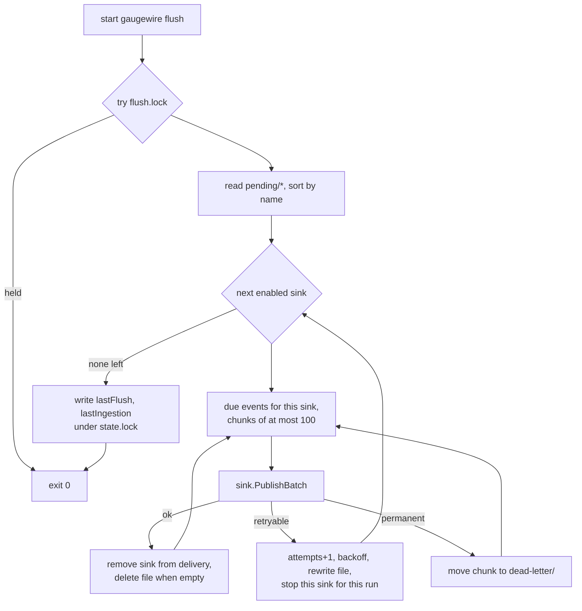

# Spool and flush

Status: Draft · Planned · 2026-09-17 · Local durability first, network second: the spool, the locks, the flusher, retries and dead letters.

## At a glance

An event is safe on disk before any delivery is attempted. The flusher is a separate,
short-lived process that takes a machine-wide lock, delivers everything that is due in
chronological order, updates or deletes event files, and exits. Nothing is ever silently
discarded: transient failures are retried with backoff, permanent failures go to a dead-letter
directory that `status` and `doctor` surface and `--requeue` can replay.

## Diagram



## Files and locks

```
state.lock     read-modify-write of state.json and spool creation. Never held during network I/O
flush.lock     one flusher per machine, taken non-blocking
pending/       <capturedAtUnixMillis>-<eventId>.json, chronological by name
dead-letter/   same files plus deadLetteredAt and reason
```

Both locks are advisory file locks, never PID files or existence checks. Every write is
temporary file, `fsync`, atomic rename; a crash cannot corrupt `state.json` or an event.

## Flusher run

1. Try `flush.lock` without blocking; if held, exit 0.
2. For each enabled sink, take the events whose `delivery[sink].nextAttemptAt ≤ now`, in order,
   in chunks of at most 100.
3. Success removes the sink from each event's `delivery`; a file with no sinks left is deleted.
4. A retryable error bumps `attempts`, sets `nextAttemptAt = now + backoff(attempts)` with
   ±20 % jitter, rewrites the file and stops this sink for this run, so a newer event is never
   delivered before an older one.
5. A permanent error moves the chunk's files to `dead-letter/` with the reason and continues.
6. Record `lastFlush` and `lastIngestion` in `state.json` under `state.lock`. Exit.

Backoff: 5 s, 30 s, 2 min, 10 min, then 30 min forever. Request timeout 15 s, whole run capped
at 2 min. The flusher never sleeps until the next attempt; a later status-line invocation
relaunches it when due work exists. With Claude idle, nothing retries, by design.

## Error classes

| Outcome | Class |
|---|---|
| transport error, timeout, DNS failure | retryable |
| HTTP 408, 429, 500, 502, 503, 504 | retryable |
| HTTP 401, 403 | permanent, `doctor` reports the sink as unauthenticated |
| HTTP 400, 404, 413, 422 and other 4xx | permanent |
| 2xx without the sink's acceptance marker | permanent |

Classification goes by HTTP status first; a body error code is recorded as `lastErrorCode`
when present and never changes the class.

## Dead letters and requeue

Dead letters are never deleted automatically. `gaugewire status` and `gaugewire doctor` show
their count and the newest reason. `gaugewire flush --requeue` moves every dead-letter file back
to `pending/` with attempts reset, for use after fixing credentials or dataset ids. The sink's
Current guard (see [databox-sink](databox-sink.md)) keeps a requeued old event from overwriting
newer state.

## Targeting

`delivery` is keyed by the sink ids enabled at capture time. Adding a sink later never sends it
historic events unless the operator requeues them explicitly.

## Open questions

None.
