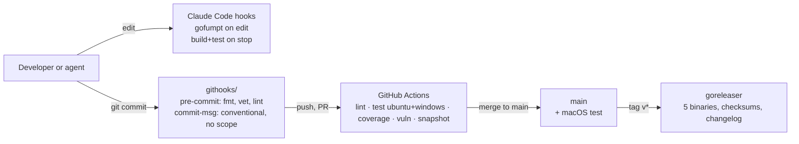

# Repository scaffold

Status: Stable · Built · 2026-09-17 · How the Gaugewire repository is built, gated, released and made legible to humans and AI agents.

## At a glance

Gaugewire is a single static Go binary built for macOS, Linux and Windows. This spec fixes the
toolchain, the quality gates, the release pipeline, the documentation system and the agent
rulebook, so that every contributor, human or AI, produces the same shapes. Its guiding rule: mechanical gates are hooks, not prose.
Everything mechanical lives in a linter, a git hook or a Claude Code hook. Rule files hold only
what needs judgment.

Decisions taken on 2026-09-17 with the repo owner: Go 1.27, plain git hooks via
`core.hooksPath`, Mermaid diagrams, CI on Ubuntu and Windows for every PR with macOS on `main`
and tags. Each became an ADR when the scaffold landed.

## Diagram



## Toolchain

| Concern | Choice | Notes |
|---|---|---|
| Go | `go 1.27`, `toolchain go1.27.1` in `go.mod` | Machines on 1.26 auto-download the toolchain. `setup-go` reads `go-version-file: go.mod`. |
| Module | `github.com/sulcer/gaugewire` | Private repo, `main` default branch. |
| Runtime deps | `github.com/gofrs/flock` | Cross-platform advisory file locks. Everything else is standard library, including `uuid`, `log/slog`, `encoding/json`, `net/http`, `flag`. |
| Test-only deps | `github.com/google/go-cmp` | Whole-struct diffs for complete-object assertions. |
| JSON | `encoding/json` v1 API | Lenient parsing of user-authored `settings.json` (case-insensitive fields, duplicate keys tolerated). Go 1.27 backs it with the v2 engine. Direct `encoding/json/v2` use is deferred. |
| Dev tools | `tools/go.mod` with `tool` directives | gofumpt, govulncheck, golangci-lint v2, goreleaser v2. Pinned in git, isolated from the product module graph. Invoked as `go tool -modfile=tools/go.mod <name>`; Makefile targets wrap the exact commands. |
| Formatting | gofumpt + gci | Import groups: standard, third party, `github.com/sulcer/gaugewire`. |
| Linting | golangci-lint v2, `version: "2"` config | `golangci-lint config verify` runs before every `run`. |

Tool versions at scaffold time: golangci-lint v2.13.2 (Go 1.27 support landed in v2.13.0),
goreleaser v2.18.2, gofumpt v0.12.0, govulncheck v1.8.0, staticcheck 2026.2.1 via golangci.

## Repository layout

```
.
├── AGENTS.md                 rulebook entry (trust hierarchy, stack, map, commands, rules index)
├── CLAUDE.md                 "@AGENTS.md" import + Claude-specific notes
├── README.md                 user-facing: what it is, install, commands
├── CONTRIBUTING.md           points at AGENTS.md and the make targets
├── Makefile                  thin wrappers around the exact commands CI runs
├── go.mod / go.sum
├── tools/go.mod / go.sum     tool directives
├── .golangci.yml  .goreleaser.yaml  .editorconfig  .gitattributes  .gitignore
├── githooks/                 pre-commit, commit-msg (POSIX sh)
├── scripts/                  coverage-gate.sh
├── .github/
│   ├── workflows/ci.yml      lint, test, coverage, vuln, snapshot
│   ├── workflows/release.yml goreleaser on v* tags
│   ├── dependabot.yml        gomod (/ and /tools) + github-actions, cooldowns
│   ├── PULL_REQUEST_TEMPLATE.md
│   └── CODEOWNERS
├── .claude/
│   ├── settings.json         permissions + hooks
│   ├── hooks/format.sh       PostToolUse hook: gofumpt on edited .go files
│   ├── hooks/verify.sh       Stop hook: go build + go test, failures as context
│   └── rules/                always-on/ and code/ (see Rulebook)
├── cmd/gaugewire/main.go
├── internal/                 product packages (see docs/spec/gaugewire/)
├── fixtures/statusline/      real and synthetic stdin payloads
└── docs/                     see Documentation system
```

Go layout follows the official module layout guidance: commands in `cmd/`, everything else in
`internal/`, no `pkg/`. Unit tests sit beside the code. Tests that spawn the built binary or
exercise many processes carry `//go:build integration`.

## Quality gates

Every gate has one command, and CI runs that same command. There is no CI-only gate.

| Gate | Command | Where it runs |
|---|---|---|
| Format | `go tool -modfile=tools/go.mod gofumpt -l .` (empty output) | Claude edit hook (`-w` on the file), pre-commit, CI lint |
| Vet | `go vet ./...` | pre-commit, CI lint |
| Lint | `go tool -modfile=tools/go.mod golangci-lint config verify && ... run` | pre-commit, CI lint |
| Tidy | `go mod tidy -diff` for `.` and `tools/` | CI lint |
| Unit tests | `go test -race -shuffle=on -count=1 ./...` | Claude stop hook (without `-race`), CI test on ubuntu and windows; macOS on push to `main` and tags |
| Integration | `go test -race -tags integration ./...` | CI test |
| Coverage | `go test -coverprofile` then `scripts/coverage-gate.sh` | CI coverage: hard gate on `internal/quota` and `internal/source/claude` (90 %), reported elsewhere |
| Vulnerabilities | `go tool -modfile=tools/go.mod govulncheck ./...` | CI on every PR and weekly schedule |
| Cross-compile | `goreleaser release --snapshot --clean` | CI snapshot on ubuntu |

golangci-lint linters: the `standard` group plus a curated set validated with `config verify`
at scaffold time. Enabled: `bodyclose`, `depguard` (deny logrus, viper, pkg/errors,
testify), `errname`, `errorlint`, `exhaustive`, `forbidigo` (no `fmt.Print*`; a command
writes to the writer it was given), `gocritic`, `gosec`, `intrange`, `misspell`, `nilerr`, `noctx`, `perfsprint`,
`revive`, `thelper`, `tparallel`, `unconvert`, `unparam`, `usestdlibvars`, `usetesting`,
`wastedassign`. `govet` runs with `enable-all` minus `fieldalignment`. Any linter that produces
noise on real code is dropped in the same PR that shows the noise.

Windows runners may lack `make`, so CI calls `go` directly. The Makefile is a convenience that
must never contain a command CI does not also run.

## Git hooks and commits

`make setup` runs `git config core.hooksPath githooks` and warms the tools. Two POSIX scripts:

- `githooks/pre-commit`: gofumpt check on staged Go files, `go vet ./...`, golangci-lint run.
- `githooks/commit-msg`: Conventional Commits **without scope**: an explicit check that the
  first line is at most 72 characters, then the shape
  `^(feat|fix|docs|style|refactor|perf|test|build|ci|chore|revert)!?: [a-z][^ ].*$`, or a
  `Merge`/`Revert`/`fixup!`/`squash!` line.

`--no-verify` is never used. Feature branches only, PRs into `main`, one semver meaning per
release tag. Pre-1.0, a breaking change bumps the minor version.

## CI and release

`ci.yml` runs on `pull_request` and `push` to `main`, with `concurrency` cancel-in-progress,
`permissions: contents: read`, actions pinned by commit SHA with the version in a comment,
`setup-go` caching keyed on both `go.sum` files. Jobs: `lint`, `test` (matrix ubuntu-latest,
windows-latest), `test-macos` (only on push), `coverage`, `vuln`, `snapshot`. A `schedule`
trigger runs `vuln` weekly.

`release.yml` runs on tags `v*`. It first runs the tests on Ubuntu, Windows and macOS, then
calls goreleaser v2 with `contents: write`: darwin and
linux on amd64 and arm64, windows on amd64, `CGO_ENABLED=0`, `-trimpath`,
`mod_timestamp: {{ .CommitTimestamp }}`, `-s -w -X main.version=... -X main.commit=... -X
main.date=...`, tar.gz archives (zip on windows), checksums, changelog grouped by commit type
(`feat`, `fix`, `perf`, others; `build`/`chore`/`ci`/`docs`/`refactor`/`style`/`test` excluded).
`gaugewire version` prints
the injected values and falls back to `debug.ReadBuildInfo` for `go install` builds.

Deferred: Homebrew tap for the Mac Mini fleet, SBOM and signing, CodeQL (needs GHAS on a
private repo). Tracked in `docs/nice-to-have.md`.

## Rulebook (agentic layer)

`AGENTS.md` is the single rulebook entry, under 150 lines: purpose, trust hierarchy, stack
table, repo map, commands, conventions in one screen, rules index, what to read first, a
never-list. `CLAUDE.md` contains `@AGENTS.md` and a short Claude Code section. An import, not a
symlink, because Windows machines join the fleet later.

Trust hierarchy, highest first: `AGENTS.md`, `.claude/rules/`, `docs/adr/`, `docs/spec/`,
`docs/how-tos/`. `docs/research/` is frozen and never cited except through the provenance
footer of a spec.

`.claude/rules/` starts small and grows only from real review findings:

| File | Scope | Content |
|---|---|---|
| `always-on/workflow.md` | every session | read order, ask vs proceed, TDD and the gate, subagent rule injection, never-list. Includes: third-party behaviour is relied on only when publicly documented; anything else is an assumption to verify |
| `always-on/adr-and-spec-discipline.md` | every session | ADR frontmatter and sections, supersede and amend back-links, spec header with `Draft|Stable` and `Built|Partial|Planned`, plans are ephemeral, flows get a Mermaid diagram |
| `always-on/simplicity.md` | every session | boring solution first, indirection must earn its place, present simple vs complex before building complex |
| `code/go-code.md` | `cmd/**/*.go`, `internal/**/*.go` | errors (`%w`, sentinels, `errors.AsType`), `context` first, `log/slog` only, `os.Exit` only in `main`, `run()` pattern, platform files by build tag, package dependency direction, comment policy |
| `code/go-testing.md` | `**/*_test.go`, `testdata/**`, `fixtures/**` | table tests, `t.Parallel`, `t.Context`, `t.TempDir`, `testing/synctest` for time, `httptest`, whole-struct `cmp.Diff`, one assertion per test, expected values never harvested from the code under test, golden `-update` only with the diff shown to a human, `integration` tag, no network |
| `code/dependencies.md` | `go.mod`, `go.sum`, `tools/**` | standard library first, a new dependency needs a one-line ADR and a govulncheck result, exact pins, Dependabot cooldown |
| `code/ci-and-release.md` | `.github/**`, `.goreleaser.yaml`, `Makefile`, `githooks/**`, `scripts/**` | same-command property, SHA pinning, least privilege, release procedure |

Always-on total stays under 200 lines. Rationale and incidents live in
`docs/why-these-rules.md`, linked from each rule, never inline.

`.claude/settings.json`:

- `permissions.deny`: `Read(.env)`, `Read(.env.*)`, `Read(**/*.key)`.
- `permissions.allow`: `go build`, `go test`, `go vet`, `go tool`, `go mod`, `go run`, `go doc`,
  `make`, read-only `git`.
- `PostToolUse`, matcher `Edit|Write`: runs `sh "${CLAUDE_PROJECT_DIR}"/.claude/hooks/format.sh`,
  a POSIX script that reads the hook's JSON from stdin, extracts `tool_input.file_path`,
  unescapes it, and runs gofumpt `-w` on `.go` files. No `jq`, so it runs on Windows.
- `Stop`: `.claude/hooks/verify.sh` runs `go build ./... && go test ./...`; on failure it writes
  the output to `.claude/hooks/last-verify.log` and returns `additionalContext` telling the agent
  to read that file. The build cache keeps no-change turns near one second.

Code review uses Claude Code's built-in `/code-review`. No repo-local review skill until a
recurring finding justifies one.

## Documentation system

```
docs/
├── README.md              index and trust hierarchy
├── adr/                   YYYY-MM-DD-kebab.md, README.md index with relations column
├── spec/                  living specs, README.md index
│   ├── repo-scaffold/     this spec
│   └── gaugewire/         product spec: README, architecture, data-contract, hot-path,
│                          reducer-and-dedupe, spool-and-flush, databox-sink, cli-and-install,
│                          testing-strategy, glossary
├── plans/                 implementation plans, committed, deleted when the feature lands
├── how-tos/               acceptance-test.md
├── research/              frozen inputs (the original ChatGPT spec)
├── why-these-rules.md     rationale and incidents behind the rules
└── nice-to-have.md        deferred work: what, why deferred, trigger, reference
```

Spec pages open with `Status: <Draft|Stable> · <Built|Partial|Planned> · <date> · <one
sentence>`, then "At a glance", a diagram when there is a flow, short body sections, "Open
questions". Flows are Mermaid fenced blocks. ADRs use a fixed format: `tags`, `status`,
`decision-date` frontmatter; Title, Members, Status, Context, Options, Decision, Consequences,
optional Out of scope; `Supersedes`/`Superseded by`/`Amends`/`Amended by` lines right after the
title; never deleted. The bar for an ADR is a decision someone would otherwise re-litigate.

Migration done on 2026-09-17: the original product spec and the design conversation live in
`docs/research/`; the design decisions became the ADRs below and the product spec pages in
`docs/spec/gaugewire/`. Implementation plans go to `docs/plans/`.

ADRs written on 2026-09-17, see [`docs/adr/`](../../adr/README.md): `go-toolchain-and-pinned-tools`,
`gates-as-hooks`, `documentation-system`, `json-config-in-one-home-directory`,
`claude-statusline-is-the-only-quota-source`, `databox-sink-targets-v1-and-acks-on-accept`.

## Walking skeleton

The scaffold is done when `cmd/gaugewire` builds with a `version` subcommand, one unit test and
one integration-tagged test pass on ubuntu and windows in CI, coverage and vuln jobs are green,
`goreleaser --snapshot` produces five binaries, the git hooks reject a scoped commit message,
and a Claude Code session in the repo shows the hooks firing.

## Open questions

- Branch protection on `main` (require PR and green CI) is a repo setting applied with `gh api`
  after the first CI run; it needs the owner's go-ahead.
- LICENSE is deferred while the repo is private.

---
Synthesized from (frozen research): `../../research/2026-09-17-claude-quota-observer-spec-v1.md`.
